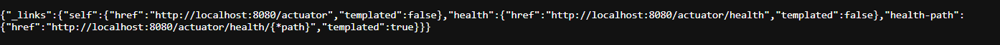

# WS24-Middleware-Technology

# 👋 1. About

Winter Semester 24/25 Code repository for PVL.

Team Members:
1. Jan Weidelich (11waja1bif@hft-stuttgart.de)
2. Sanjay Prabhu Kunjibettu (41kusa1mst@hft-stuttgart.de)

# 2. Geting Started

## 2.1 Codespaces on Github

1. Create a new repository on Github
2. Check the `codespaces` and create one for your repository.

## 2.2 Spring Boot

1. Click on the link: https://start.spring.io/
2. Follow the screenshots below:


4. Use the `Terminal` to write the `curl` commands below:

```bash
$ curl https://start.spring.io # get example codes
$ curl -G https://start.spring.io/starter.zip -d dependencies=web,actuator -d type=maven-project -o demo.zip # actuator:= dependency
$ unzip demo.zip
$ mvn spring-boot:run # build the maven project and expose it to the cloud
```
5. The service is exposed to the cloud. Go to `PORTS` on your terminal and click the address. You will initially get a `Whitelabel Error Page` as the current application is not doing anything.
```bash
https://rötgängertötgänger-8080.app.github.dev # example
```
6. To check the exposed `REST-API`, add `/actuator` to the link above.
```bash
https://rötgängertötgänger-8080.app.github.dev/actuator # example
```

   